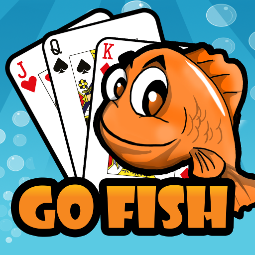

# Review Project 
## Unit Testing, Inheritance, Streams and Collections

This week you learned about Unit Testing, Inheritance, Streams and Collections. 
This project is intended to help you solidify the concepts that you learned
throughout the week.

You will create a console application that is based on a card game of your choice.
Think about a card game that you like to play and create an application that takes you through
the flow of the game.

Your starter code includes a few classes that you may choose to use. You can modify them as
needed or you can even replace them with your own classes completely.

Attempt to use some of the new collections that we discussed in class this week.
Your first priority is to get your game to work correctly. You can alway modify
the code later if needed.

## Evaluation criteria and functional requirements

* The project must compile (it cannot have any build errors).
* Create a class and inheritance structure where appropriate
  * Depending on the type of card game you choose may determine if cards should use inheritance
* Write unit tests for your classes
  * The application flow and the user interface classes do not need Unit Tests
    (UnitTests are more difficult to write for these types of classes)
* Try to find code where Streams could simplify your code
* Consider using collections besides an ArrayList if possible (not required)

## Go Fish Card Game  

Game description can be found here:  
https://thegeniusofplay.org/genius/play-ideas-tips/play-ideas/go-fish-card-game.aspx

and on Wikipedia:
https://en.wikipedia.org/wiki/Go_Fish

### Game setup 
Number of players: 2 - 5  
Five cards are dealt from a standard 52-card deck to each player, or seven cards if there are only two players.  
The remaining cards are shared between the players, usually spread out in a disorderly pile referred to as the "ocean" or "pool".

### Game flow - how to play the game
- The player whose turn it is to play asks any another player for their cards of a particular face value. For example, Player 1 may ask, "Player 2, do you have any eights?"
Player 1 must have at least one card of the rank they requested.

- Player 2 must hand over all cards of that face value they have. If Player 2 does not have the requested card, they would tell Player A to “Go Fish!”

- If a player is told to “Go fish!” they pull a random card from the center and add it to their hand.

- If a player gets a set of four matching cards, they must lay down the matched set immediately in full view of the other players.

- After a player is told to “Go Fish!” and selects their random card, their turn ends. If they successfully secure a requested card from another player, they get another turn.

### Game end
Play continues until one player runs out of cards.

### Winner
The game is won by the player who has collected the most sets of four like cards. 

### Gurrent game version features
- Only two players
- Two game options: Player VS Copmuter and Player VS Player
- For game with Computer, player can select to play in Normal Mode or Testing Mode
- in Testing Mode, Player can see Computer's cards

